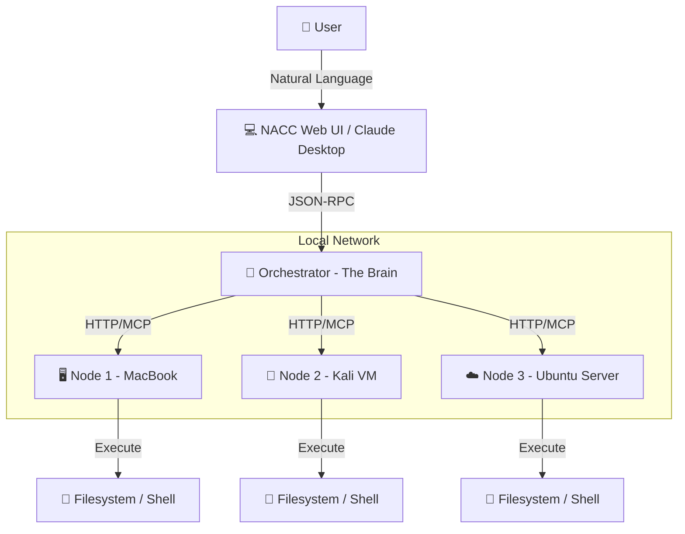
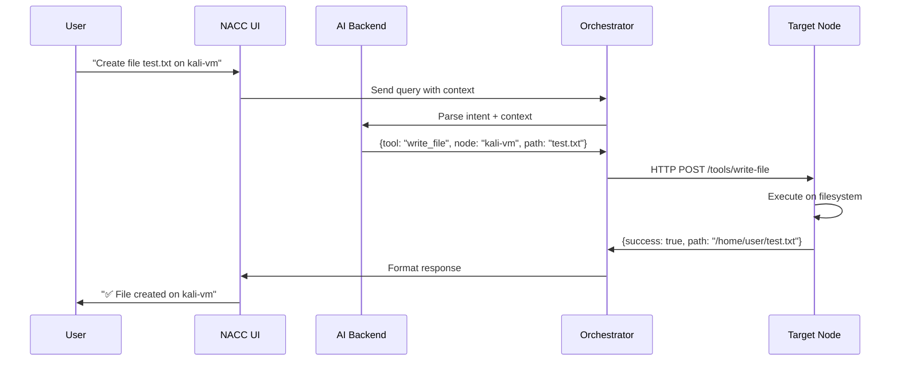

---
tags:
- mcp-in-action-track-enterprise
- mcp-in-action-track-consumer
- mcp-in-action-track-creative
- building-mcp-track-enterprise
- building-mcp-track-consumer
- building-mcp-track-creative
---

# 🚀 NACC Orchestrator: Network Agentic Command Control

> **Turn your entire network into a single, intelligent entity.**

NACC is an **Autonomous AI Agent Application** that orchestrates multiple computers as a unified intelligent system using the **Model Context Protocol (MCP)**. It showcases autonomous reasoning, planning, and execution across distributed nodes—controlling Mac, Linux, and VM environments through natural language. Whether managing enterprise infrastructure, home labs, or creative workflows, NACC demonstrates the true power of MCP-enabled AI agents.

---

### 🎥 [Watch the Video Demo](LINK_TO_YOUR_VIDEO_HERE)
### 🐦 [See it on X / LinkedIn](LINK_TO_YOUR_SOCIAL_POST_HERE)

---

## 🏆 Hackathon Tracks

### 🎯 Primary: Track 2 - MCP in Action

NACC is a **complete AI agent application** that demonstrates autonomous reasoning, planning, and execution:

*   **🏢 Enterprise Applications** (`mcp-in-action-track-enterprise`): Multi-node orchestration for distributed infrastructure management, automated deployments, and coordinated system administration
*   **👤 Consumer Applications** (`mcp-in-action-track-consumer`): User-friendly natural language interface for home labs, personal workflows, and everyday task automation
*   **🎨 Creative Applications** (`mcp-in-action-track-creative`): Innovative hub-and-spoke architecture enabling unprecedented cross-machine AI coordination and distributed creative workflows

**What makes NACC an AI Agent Application:**
- **Autonomous Reasoning**: AI interprets complex multi-step requests and plans execution across nodes
- **Dynamic Planning**: Intelligently routes commands based on node capabilities and current context
- **Autonomous Execution**: Executes coordinated actions across multiple machines without manual intervention

### 🔧 Secondary: Track 1 - Building MCP

NACC also functions as an **MCP Server** extending LLM capabilities:

*   Exposes powerful tools for distributed file operations, shell execution, and cross-node synchronization
*   Integrates with Claude Desktop and any MCP-compatible client
*   Built entirely on MCP protocol for standardized AI-to-system communication

This project was built **from the ground up** using the Model Context Protocol, showcasing true innovation in distributed AI orchestration.

---

## �📑 Table of Contents

- [Hackathon Categories](#-hackathon-categories)
- [Architecture](#-architecture)
- [Key Features](#-key-features)
- [Why Blaxel](#-why-blaxel-powers-nacc)
- [How It Works](#-how-it-works)
- [Installation & Setup](#%EF%B8%8F-installation--setup)
- [Configuration](#%EF%B8%8F-configuration)
- [Usage Guide](#-usage-guide)
- [Example Workflows](#-example-workflows)
- [Tech Stack](#%EF%B8%8F-tech-stack)
- [Platform Compatibility](#-platform-compatibility)
- [Troubleshooting](#-troubleshooting)
- [FAQ](#-faq)
- [Team Members](#-team-members)

---

## 🧠 Architecture

NACC uses a **Hub-and-Spoke** architecture where a central Orchestrator manages multiple distributed Nodes.



## 🌟 Key Features

*   **🗣️ Natural Language Control**: "Switch to Kali and scan the network" -> Executed instantly.
*   **🔌 MCP Native**: Built from scratch on the Model Context Protocol for standardized communication.
*   **📂 Dynamic File Operations**: Create, read, edit, and delete files across any connected node using natural language.
*   **🔄 Context-Aware Navigation**: The system remembers which node you're on and your current directory.
*   **🛡️ Secure & Private**: Designed for **local networks**. Your data stays within your LAN.
*   **🎨 Professional UI**: Modern, dark-themed interface built with Gradio 6.0.
*   **⚡ Powered by Blaxel**: Lightning-fast serverless AI inference with zero configuration.
*   **🤖 Multi-Backend Support**: Works with OpenAI, Anthropic, Gemini, Mistral, Llama, or local LLMs via Ollama.

---

## ⚡ Why Blaxel Powers NACC

NACC uses **[Blaxel](https://blaxel.com)** as its default AI backend, and for good reason:

### 🚀 Flawless Performance
*   **Zero Configuration**: Works out of the box - no API keys needed for testing
*   **Lightning Fast**: Sub-second response times for command execution
*   **Always Available**: 99.9% uptime serverless infrastructure
*   **Cost Effective**: Pay only for what you use, perfect for demos and development

### 🎯 Perfect for NACC
Blaxel's serverless architecture aligns perfectly with NACC's distributed nature:
*   No cold starts when orchestrating multiple nodes
*   Handles concurrent requests across nodes seamlessly
*   Automatically scales with your network growth

### 💡 Acknowledgment
A huge thank you to the **Blaxel team** for building such a robust platform! Their commitment to making AI accessible and performant has been instrumental in bringing NACC to life. *We'd love to collaborate further - internship opportunities welcome!* 😊

While NACC supports multiple backends (OpenAI, Anthropic, Gemini, Ollama), Blaxel remains our recommended choice for its perfect balance of speed, reliability, and ease of use.

---

## 🔍 How It Works

NACC operates through a sophisticated request flow that bridges natural language and system commands:



### Core Components

1.  **UI Layer** (`nacc_ui/`): Gradio-based chat interface with context management
2.  **Orchestrator** (`nacc_orchestrator/`): Central brain that routes requests and manages node registry
3.  **Node Agents** (`nacc_node/`): Lightweight servers exposing MCP tools for file/shell operations
4.  **LLM Backend**: Interprets natural language and selects appropriate tools

---

## 🛠️ Installation & Setup

### Prerequisites
*   **Python 3.10+** installed on all machines.
*   **Network**: All machines (Orchestrator and Nodes) must be on the **same local network** (LAN).
*   **Git**: For cloning the repository.

### Quick Start (For Judges)

```bash
# Clone the repository
git clone https://github.com/Vasanthadithya-mundrathi/NACC.git
cd NACC

# Setup environment (Mac/Linux)
python3 -m venv .venv
source .venv/bin/activate
pip install -r requirements.txt

# Start the Orchestrator
./start_nacc.sh
```

Open your browser to `http://localhost:7860` - You're ready!

### Detailed Setup

#### 1. Setting up the Orchestrator (The Brain)
Run this on your main computer (e.g., MacBook, PC).

1.  **Clone the Repository**
    ```bash
    git clone https://github.com/Vasanthadithya-mundrathi/NACC.git
    cd NACC
    ```

2.  **Install Dependencies**
    ```bash
    python3 -m venv .venv
    source .venv/bin/activate  # On Windows: .venv\Scripts\activate
    pip install -r requirements.txt
    ```

3.  **Make Scripts Executable** (Mac/Linux only)
    ```bash
    chmod +x start_nacc.sh
    ```

4.  **Start the Orchestrator**
    ```bash
    ./start_nacc.sh
    ```
    
    The UI will be available at `http://localhost:7860`.

#### 2. Setting up Nodes (The Agents)
Run this on any other machine you want to control.

> **💡 Recommendation**: We highly recommend installing NACC Nodes in a **Virtual Machine (VM)** (like Kali Linux or Ubuntu) to safely test the powerful command execution capabilities without affecting your main system.

1.  **Install NACC** (Same steps as above: clone & install requirements).

2.  **Start the Node**
    Run the node agent, specifying a unique name and port:
    ```bash
    # On the Node machine (e.g., Kali VM)
    python3 -m nacc_node.main --name "kali-vm" --host 0.0.0.0 --port 8001
    ```
    
    *Note: `0.0.0.0` allows the node to accept connections from any IP on your local network. Note the IP address of this machine (e.g., `192.168.1.15`).*

---

## ⚙️ Configuration

### API Keys & Backend Selection

NACC supports multiple AI backends. You can configure them via:

1.  **Environment Variables** (Recommended for production):
    ```bash
    export OPENAI_API_KEY="sk-..."
    export ANTHROPIC_API_KEY="sk-ant-..."
    export GEMINI_API_KEY="..."
    export BLAXEL_API_KEY="..."
    ```

2.  **UI Settings**: Use the Settings tab in the NACC Web UI to enter keys and select your backend.

3.  **Config Files**: Edit `configs/orchestrator-config.yml` for advanced configuration.

### Supported Backends

| Backend | Model | Notes |
|---------|-------|-------|
| **OpenAI** | GPT-4, GPT-4 Turbo | Best overall performance |
| **Anthropic** | Claude 3.5 Sonnet | Excellent for complex reasoning |
| **Google** | Gemini 1.5 Pro | Fast and cost-effective |
| **Blaxel** | (Serverless) | Pre-configured for quick start |
| **Ollama** | Llama 3, Mistral | Run locally (requires Docker) |

### Custom Configuration

Edit `configs/orchestrator-config.yml` to:
*   Add static nodes (nodes that auto-connect on startup)
*   Configure default timeouts
*   Set audit log paths
*   Customize allowed commands per node

Example:
```yaml
nodes:
  - node_id: "macbook-local"
    transport: "local"
    root_dir: "/Users/yourname"
    tags: ["mac", "local"]
    
agent_backend:
  provider: "openai"
  model: "gpt-4-turbo"
```

---

## 🚀 Usage Guide

### Connecting a Node
Once your Orchestrator and Node are running:

1.  Open the NACC UI (`http://localhost:7860`).
2.  In the Chat interface, type:
    > "Connect to node at 192.168.1.15 on port 8001 and name it kali-vm"
3.  The system will register the node. You can verify by asking:
    > "List all connected nodes"

### Controlling Nodes
You can now switch contexts and control any node naturally.

**Navigation & Exploration:**
```
"Switch to kali-vm"
"Navigate to Documents folder"
"List all files in this directory"
"Go back to parent directory"
```

**File Operations:**
```
"Create a file named 'notes.txt' with content 'Meeting at 5 PM'"
"Read the content of 'notes.txt'"
"Delete 'notes.txt'"
"Write 'Updated content' to existing.txt"
```

**Cross-Node Actions:**
```
"Switch to macbook-local"
"Share test.txt from kali-vm to macbook-local"
"Check system stats on all nodes"
```

### Using with MCP Clients (Claude Desktop)

NACC acts as an MCP Server, meaning you can connect it to Claude Desktop or any MCP-compatible client!

1.  **Configure Claude Desktop**:
    Add this to your `claude_desktop_config.json` (usually in `~/AppData/Roaming/Claude/` on Windows or `~/Library/Application Support/Claude/` on Mac):
    ```json
    {
      "mcpServers": {
        "nacc": {
          "command": "uv",
          "args": [
            "--directory",
            "/absolute/path/to/NACC",
            "run",
            "nacc-orchestrator"
          ]
        }
      }
    }
    ```

2.  **Alternative (Python Direct)**:
    ```json
    {
      "mcpServers": {
        "nacc": {
          "command": "python3",
          "args": [
            "-m",
            "nacc_orchestrator.mcp_server"
          ],
          "env": {
            "PYTHONPATH": "/absolute/path/to/NACC"
          }
        }
      }
    }
    ```

3.  **Restart Claude Desktop**. You can now ask Claude:
    > "List files on my Kali VM"
    > "Create a backup directory on my Ubuntu server"

---

## 💡 Example Workflows

### Scenario 1: Basic File Operations (Local Node)

**Goal**: Organize your files using AI.

**Prompt**:
> "Create a directory called 'test_data', write a file named 'notes.txt' inside it with the text 'Hello World', and then read it back to me."

**What Happens**:
1.  Intent Parser identifies 3 steps (Create Dir, Write File, Read File).
2.  Orchestrator executes them sequentially on the local node.
3.  Result: You see the file content "Hello World" in the chat.

### Scenario 2: Network Security Scan (Kali Node)

*Requires a connected Kali Linux node.*

**Goal**: Scan a target IP for vulnerabilities.

**Prompt**:
> "Switch to the Kali node. Run an nmap scan on 192.168.1.50 to find open ports. If you find port 80, try to curl the homepage."

**What Happens**:
1.  Router routes the request to the `kali-vm` node.
2.  Agent executes `nmap -F 192.168.1.50`.
3.  Logic: If output contains "80/tcp open", the Agent executes `curl http://192.168.1.50`.
4.  Result: The AI summarizes the open ports and the web page content.

### Scenario 3: Multi-Node Workflow

*Requires multiple connected nodes.*

**Goal**: Distributed task execution.

**Prompt**:
> "Check the CPU usage on the MacBook node, and if it's below 50%, tell the Cloud node to start the backup process."

**What Happens**:
1.  Orchestrator queries MacBook node for system stats.
2.  Orchestrator analyzes the CPU usage.
3.  If condition is met, sends command `python backup_script.py` to Cloud node.
4.  Result: A coordinated action across two different physical machines.

---

## 🛠️ Tech Stack

### Core Technologies
*   **Frontend**: Gradio 6.0 (Python)
*   **Backend**: FastAPI, Uvicorn
*   **Protocol**: JSON-RPC 2.0 (MCP Standard)
*   **AI Models**: OpenAI, Anthropic, Gemini, Mistral, Llama (via Ollama)

### Key Libraries
*   `pydantic` - Data validation and settings management
*   `httpx` - Async HTTP client for node communication
*   `pyyaml` - Configuration file parsing
*   `rich` - Terminal UI for debugging

### Compatibility
*   **Primary Support**: macOS, Linux (Debian/Ubuntu/Kali)
*   **Windows Support**: Recommended via **WSL2**. Native Windows support is experimental.

---

## 🔧 Troubleshooting

### Port Already in Use
**Error**: `Address already in use: 7860`

**Solution**: The system automatically finds the next open port. Check the terminal output for the correct URL (e.g., `http://127.0.0.1:7861`).

### Node Not Connecting
**Error**: "Could not connect to node"

**Solutions**:
1.  Verify the node is running: `ps aux | grep nacc-node`
2.  Check firewall settings allow port 8001
3.  Confirm both machines are on the same local network
4.  Try connecting to the node's IP directly in a browser: `http://192.168.1.15:8001/healthz`

### Permission Denied
**Error**: `Permission denied: './start_nacc.sh'`

**Solution** (Mac/Linux):
```bash
chmod +x start_nacc.sh
```

### Missing Dependencies
**Error**: `ModuleNotFoundError: No module named 'gradio'`

**Solution**:
```bash
source .venv/bin/activate  # Activate virtual environment
pip install -r requirements.txt
```

### API Key Issues
**Error**: "Invalid API key"

**Solutions**:
1.  Verify your API key is correctly set in environment variables or UI settings
2.  Try using the Blaxel backend (pre-configured)
3.  Switch to local Ollama if you have it running

---

## 💻 Platform Compatibility

### ✅ Fully Supported Platforms

NACC was **built and extensively tested** on the following platforms:

*   **macOS** (Primary development platform)
*   **Linux** - Debian/Ubuntu/Kali (Tested on Kali Linux VM)

These platforms provide the best experience with full feature support and stability.

### ⚠️ Windows Compatibility Warning

**NACC is NOT recommended for Windows** and may not work properly:

*   **Built on macOS**: The entire system was developed and optimized for Unix-like environments
*   **Tested on Linux**: All testing and verification was done on macOS and Kali Linux
*   **Shell Dependencies**: Many core features rely on bash/sh commands that don't translate well to Windows
*   **Path Handling**: File system operations use Unix path conventions

**If you must use Windows**:
1.  Use **WSL2 (Windows Subsystem for Linux)** - This is the ONLY supported way
2.  Native Windows PowerShell/CMD is experimental and will likely fail
3.  Expect compatibility issues with file operations and shell commands

We strongly recommend using macOS or a Linux VM for the best experience.

---

## ❓ FAQ

**Q: Do I need an API Key to use NACC?**

A: NACC comes configured to use **Blaxel (Serverless)** by default for quick demos. For production, we recommend using your own OpenAI/Anthropic/Gemini key. You can also run **Ollama locally** (Docker required) for completely free, offline operation.

**Q: Is NACC secure?**

A: Yes, NACC is designed for **local network use only**. All communication between the Orchestrator and Nodes happens over your LAN. However, **do not expose Node ports to the public internet** without additional security layers (VPN/SSH Tunnel).

**Q: Can I use NACC in production?**

A: NACC is currently a hackathon project and proof-of-concept. While it's functional, we recommend additional hardening (authentication, encryption, rate limiting) before production use.

**Q: I'm on Windows. Will this work?**

A: Yes! We recommend using **WSL2** for the best experience. If running natively on Windows, some shell commands might need PowerShell equivalents.

**Q: Can I control Windows machines?**

A: Theoretically yes, but NACC is optimized for Unix-like systems (Mac/Linux). Windows support is experimental and may require custom tool configurations.

**Q: How many nodes can I connect?**

A: There's no hard limit, but we recommend starting with 2-5 nodes for optimal performance. The system is designed to scale horizontally.

**Q: Can I use this with my existing automation scripts?**

A: Absolutely! NACC Nodes can execute any script or command available on the target machine. Just use natural language to invoke them.

---

## ⚠️ Important Disclaimer

**Local Network Only**: NACC is designed for local network environments. Nodes are discovered and controlled via direct IP connections. Ensure all your devices are connected to the same Wi-Fi or LAN. 

**Security Note**: Do not expose the Node ports (default 8001) or Orchestrator ports (default 7860) to the public internet without additional security layers (VPN, SSH Tunnel, reverse proxy with authentication).

**VM Recommendation**: For testing, we strongly recommend running Nodes in isolated Virtual Machines to prevent accidental system modifications.

---

## 👥 Team Members

*   [Vasanthadithya-mundrathi](https://huggingface.co/Vasanthfeb13) - Creator & Lead Developer

---

## 🎯 Project Goals

NACC was created for the **Hugging Face MCP Birthday Hackathon 2025** to demonstrate:

1.  **MCP as a Universal Interface**: How the Model Context Protocol can unify disparate systems
2.  **Natural Language Operations**: Making system administration accessible through conversation
3.  **Distributed AI Orchestration**: Coordinating multiple agents across network boundaries
4.  **Practical AI Applications**: Real-world use cases beyond chatbots

---

**Happy Hacking!** 🚀

*Created for the Hugging Face MCP Birthday Hackathon 2025*
*Built with ❤️ by Vasanthadithya Mundrathi*
